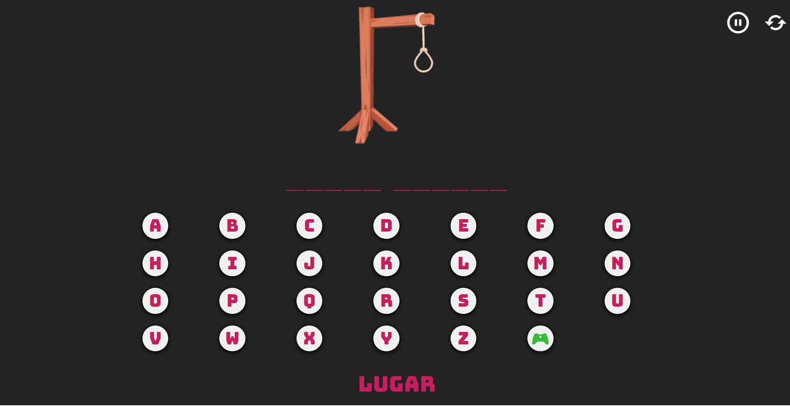

<h1> Jogo da forca

Um jogo da forca simples feito com Html, CSS, Javascript e Bootstrap.

## 📝 Jogo da forca

 O site foi feito por base das playlist gratuitas do canal <a href = "https://www.instagram.com/agnaldo.guima/">Agnaldo Guimarães.</a> Eles explica passo a passo de um modo didático e intuitivo. O projeto ainda está em andamento e em constante atualização. 

 A <a href = "https://www.youtube.com/watch?v=OvxbtRLUgXY&list=PLUPt90PJkVdU5kHy_QHmJi0MY_Zgw7CJV">playlist</a> está disponivel gratuitamento no youtube

<h2>Já o site feito por mim com algumas mudanças do projeto inicial você pode vizualizar <a href="https://capitaozila.github.io/JogoDaForca/html/jogoforca.html">aqui</a>. Caso você perca, pode apertar no botão com o icone de controle remoto, ou atualizar a página caso prefira.</h2>

